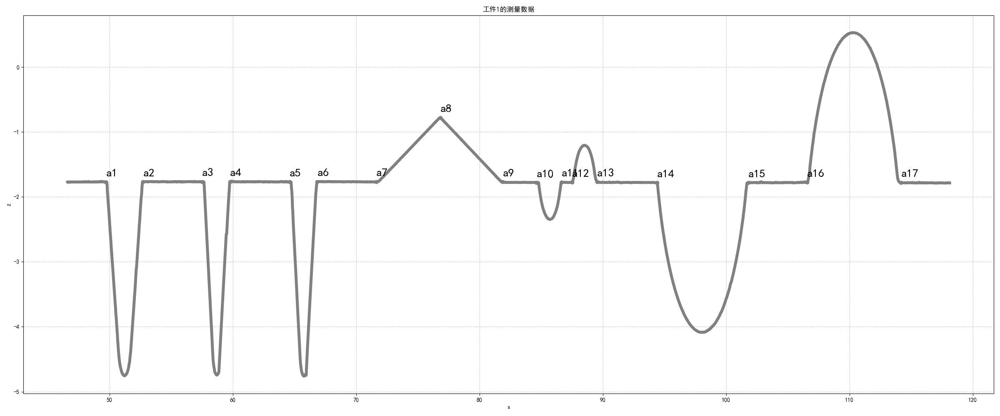
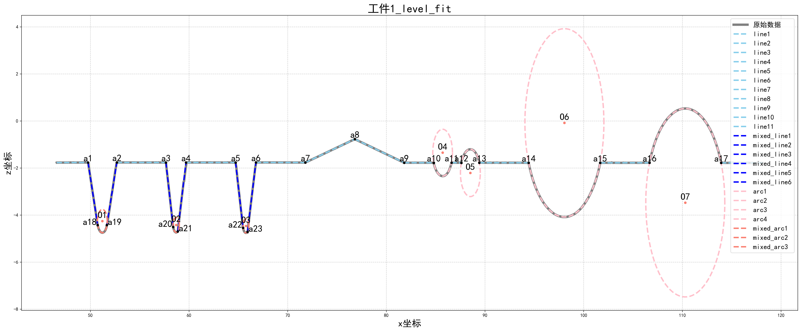

# 数模第二周
这是数模第二周的内容。
## 问题一
1. 检测转折点方式： 首先通过绘图手动选取明显的转折点，然后去除掉其x轴<mark>周围0.2的区域</mark>，采用区间内部的点进行拟合，最后根据拟合方程计算交点，得到最终转折点。
2. 直线间交点计算：Ai*x + Bi*z + Ci = 0，det = A1 * B2 - A2 * B1，x = (B1 * C2 - B2 * C1) / det，z = (A2 * C1 - A1 * C2) / det
3. 线圆间交点计算：z = mx + c,代入圆方程：(x-h)^2 + (mx+c-k)^2 = r^2求解二次方程,并<mark>设置delta的阈值0.5</mark>，若delta的绝对值<0.5,则视为线圆之间仅有一个切点。
4. 数据绘图：
5. 直线拟合：根据转折点确定的区间读取数据，采用numpy库的stats.linregress函数进行线性拟合。
6. 弧线拟合:使用数据的质心作为圆心初始估计,计算到质心的平均距离作为半径初始估计，采用numpy库的least_squares中的‘lm'方法进行迭代。 
7. 混合拟合:第三类拟合中的过渡区间选取办法：在对应区间对z轴<mark>以0.1为间隔</mark>统计点的个数，选择点的个数急剧变多的区间拟合圆弧，点的个数变化不大的区间拟合直线，再计算交点得到转折点。
   经多次区间判断、实际测试及绘图之后，选取得到最合适的拟合区间如下：
    1) [a1,a2]：表见[Figures/Q1_complement.txt](Figures/Q1_complement.txt)，选取z为[-4.3,-4.8]的区域拟合圆弧，取[-1.9,-3.8]的区域拟合两端直线。
    2) [a3,a4]：表见上述链接，选取z为[-4.3,-4.8]的区域拟合圆弧，取[-2.1,-4.2]的区域拟合两端直线。
    3) [a5,a6]：表见上述链接，选取z为[-4.2,-4.8]的区域拟合圆弧，取[-2.1,-4.0]的区域拟合两端直线。
8. 所有拟合结果见[Figures/Q1_results.txt](Figures/Q1_results.txt)。
   1) 每个区间均标记了对应图像的名字，其拟合结果包含了方程系数/圆参数(x,z,r)和<mark>拟合评估指标</mark>，请自行整理并保留合适的小数位数；  
   2) 直线方程已经计算了对应的角度并标注了参数名，其中接近180°的不妨视为180°,系数接近0的不妨视为0。
   3) 文档末尾给出了角度以外的所有待标参数，角度见第上一条。
9. 总拟合图：

## 问题二
1. 数据绘图：
2. 混合拟合:选取得到最合适的拟合区间如下：
    1) [a1,a2]：表见[Figures/Q2_complement.txt](Figures/Q2_complement.txt)，选取z为[4.7,5.0]的区域拟合圆弧，取[5.3,7.5]的区域拟合两端直线。
    2) [a3,a4]：表见上述链接，选取z为[4.7,5.0]的区域拟合圆弧，取[5.2,7.7]的区域拟合两端直线。
    3) [a5,a6]：表见上述链接，选取z为[4.7,5.0]的区域拟合圆弧，取[5.3,7.5]的区域拟合两端直线。
3. 所有拟合结果见[Figures/Q2_results.txt](Figures/Q2_results.txt)。
4. 总拟合图：

## 问题三
1. 目测选择每次实验数据的目标直线所在区间并拟合。
2. 再选取目标直线右侧与之相交的那条直线，目测其区间，并拟合，得到10个交点。取10个交点的质心为标准点，计算各自的水平偏差后，把10份旋转后的数据平移到标准点，再对z轴进行平均，得到轮廓图，并根据该图计算参数。
